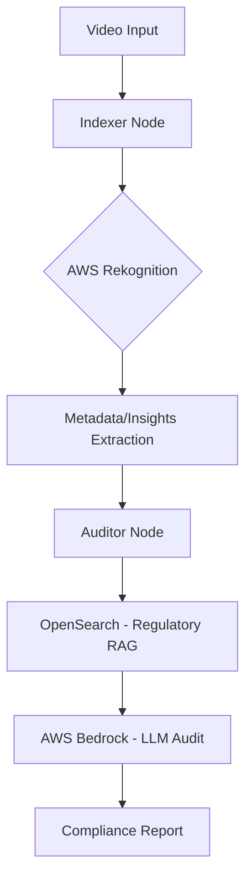

# BotoCop: Automated Video Compliance Auditor

**BotoCop** is a sophisticated, AI-powered video compliance pipeline built to automate the auditing of video content against brand and regulatory guidelines. Leveraging a robust **RAG (Retrieval-Augmented Generation)** architecture and **LLMops** best practices, BotoCop transitions complex video data into actionable compliance insights.

---

## 🚀 Key Features

- **Automated Video Indexing**: Advanced visual and audio analysis using **AWS Rekognition**.
- **Intelligent RAG**: Context-aware auditing using **AWS Bedrock (Claude 3.5/Haiku)** and **OpenSearch** for fast, high-accuracy regulatory lookups.
- **Structured LLMops**: Orchestrated workflows via **LangGraph** to ensure reliable, multi-node processing (Indexer -> Auditor).
- **Proactive Cleaning**: Automated temporary file management and secure storage in **Amazon S3**.

---

## 🏗️ Architecture



---

## 🛠️ Tech Stack

- **Framework**: LangChain, LangGraph
- **Cloud Infrastructure**: AWS (S3, Rekognition, OpenSearch, Bedrock)
- **Model**: Anthropic Claude 3.5 Sonnet (via Amazon Bedrock)
- **Database**: Amazon OpenSearch Service (Vector Store)
- **Language**: Python 3.12+ (managed by `uv`)

---

## ⚙️ Environment Configuration

Ensure your `.env` file is configured with the following parameters:

```bash
# AWS Connectivity
REGION="eu-north-1"
AWS_STORAGE_CONNECTION_STRING="your_connection_string"

# LLM & Embeddings
AWS_OPENAI_MODEL="anthropic.claude-opus-4-6-v1"
AWS_OPENAI_EMBEDDING_DEPLOYMENT="amazon.titan-embed-text-v2:0"

# OpenSearch Configuration
OPENSEARCH_ENDPOINT="your_endpoint"
OPENSEARCH_INDEX_NAME="your_index"
```

---

## 📦 Installation

This project uses `uv` for lightning-fast dependency management.

```bash
# Install dependencies
uv sync

# Run the pipeline
uv run main.py
```

---

*“Maintaining brand integrity, one frame at a time.”*
