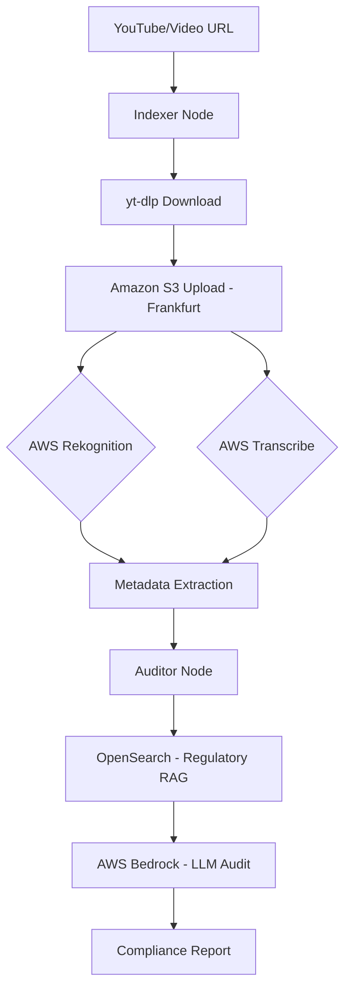

# BotoCop: Automated Video Compliance Auditor

**BotoCop** is a sophisticated, AI-powered video compliance pipeline built to automate the auditing of video content against brand and regulatory guidelines. Leveraging a robust **RAG (Retrieval-Augmented Generation)** architecture and **LLMops** best practices, BotoCop transitions complex video data into actionable compliance insights.

---

## 🚀 Key Features

- **YouTube Integration**: Robust video downloading directly from YouTube using `yt-dlp`.
- **Automated Video Indexing**: Advanced visual analysis using **AWS Rekognition** for label detection and metadata extraction.
- **Integrated Transcription**: Automated audio-to-text processing via **AWS Transcribe** with localized polling for reliable result fetching.
- **Intelligent RAG**: Context-aware auditing using **AWS Bedrock (Claude 3 / Titan)** and **OpenSearch** for fast, high-accuracy regulatory lookups.
- **Structured LLMops**: Orchestrated workflows via **LangGraph** to ensure reliable, multi-node processing (Indexer -> Auditor).
- **Proactive Cleaning**: Automated temporary file management and secure storage in **Amazon S3**.

---

## 🔄 Workflow

The BotoCop pipeline follows a structured, multi-step process for each video:

1.  **Ingestion**: Downloads video from YouTube/URL using `yt-dlp`.
2.  **Indexing**: Local video is uploaded to **Amazon S3 (Frankfurt region)** for persistent storage.
3.  **Visual Analysis**: **AWS Rekognition** starts a label detection job on the S3 object.
4.  **Audio Analysis**: **AWS Transcribe** initiates a transcription job to extract the video soundtrack.
5.  **Polling**: The system automatically polls both AI services until results are ready.
6.  **Retrieval**: The **Auditor Node** retrieves compliance rules from **OpenSearch** based on video context.
7.  **Audit**: **AWS Bedrock (Claude 3 Sonnet)** performs a deep analysis comparing video metadata and transcript against guidelines.
8.  **Reporting**: Generates a structured JSON compliance report with severity levels and action items.

---

## 🏗️ Architecture



---

## 🛠️ Tech Stack

- **Orchestration**: LangGraph, LangChain
- **Visual Analysis**: AWS Rekognition
- **Audio Analysis**: AWS Transcribe
- **LLM Engine**: Amazon Bedrock (Anthropic Claude 3)
- **Vector Database**: Amazon OpenSearch Service
- **Storage**: Amazon S3
- **Video Processing**: yt-dlp
- **Language**: Python 3.13+ (managed by `uv`)

---

## ⚙️ Environment Configuration

Your `.ENV` file must be configured for the **Frankfurt (`eu-central-1`)** region to ensure endpoint stability:

```bash
# AWS Region
AWS_STORAGE_CONNECTION_STRING=""

AWS_OPEN_AI_KEY="KsZp0OIlI4m3iLUp6VLPrPDURUYyPAg19vVrurZL"
AWS_OPENAI_MODEL="anthropic.claude-3-sonnet-20240229-v1:0"
REGION="eu-central-1"

AWS_OPENAI_EMBEDDING_DEPLOYMENT="amazon.titan-embed-text-v1"

AWS_SEARCH_ENDPOINT=""
AWS_SEARCH_API_KEY=""
AWS_SEARCH_INDEX_NAME="brand-compliance-rules"


# azure video indexer
# AZURE_VI_NAME=""
# AZURE_VI_LOCATION="trial"
# AZURE_VI_KEY=""
# AZURE_VI_ACCOUNT_ID=""

AWS_SUBSCRIPTION_ID=""
# AZURE_RESOURCE_GROUP=""

# APPLICATIONINSIGHT_CONNECTION_STRING=""

LANGCHAIN_TRACING_V2="true"
LANGCHAIN_ENDPOINT="https://api.smith.langchain.com"
LANGCHAIN_API_KEY=""
LANGCHAIN_PROJECT="brand-compliance-rules"

# GPU Configuration
TORCH_DEVICE="cuda"

```

---

## 📦 Getting Started

This project uses `uv` for efficient dependency management.

```bash
# 1. Install dependencies
uv sync

# 2. Run the full compliance simulation
uv run python main.py
```

### **AWS Setup Checklist**
1.  **S3 Bucket**: Must be created in `eu-central-1` (e.g., `orchestra-frankfurt`).
2.  **Model Access**: Ensure **Claude 3 Sonnet** and **Titan Text Embeddings** are enabled in the Amazon Bedrock console.
3.  **IAM Permissions**: Ensure your user has `InvokeModel`, `S3`, `Rekognition`, and `Transcribe` permissions.

---

*“Maintaining brand integrity, one frame at a time.”*
