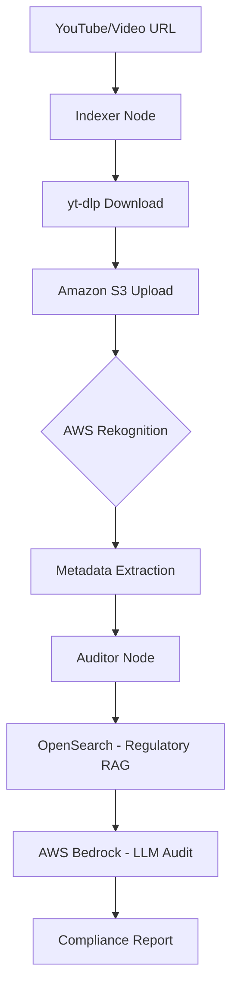

# BotoCop: Automated Video Compliance Auditor

**BotoCop** is a sophisticated, AI-powered video compliance pipeline built to automate the auditing of video content against brand and regulatory guidelines. Leveraging a robust **RAG (Retrieval-Augmented Generation)** architecture and **LLMops** best practices, BotoCop transitions complex video data into actionable compliance insights.

---

## 🚀 Key Features

- **YouTube Integration**: Robust video downloading directly from YouTube using `yt-dlp`.
- **Automated Video Indexing**: Advanced visual analysis using **AWS Rekognition** for label detection and metadata extraction.
- **Intelligent RAG**: Context-aware auditing using **AWS Bedrock (Claude / Opus)** and **OpenSearch** for fast, high-accuracy regulatory lookups.
- **Structured LLMops**: Orchestrated workflows via **LangGraph** to ensure reliable, multi-node processing (Indexer -> Auditor).
- **Proactive Cleaning**: Automated temporary file management and secure storage in **Amazon S3**.

---

## 🔄 Workflow

The BotoCop pipeline follows a structured, multi-step process for each video:

1.  **Ingestion**: Downloads video from YouTube/URL using `yt-dlp`.
2.  **Indexing**: Local video is uploaded to **Amazon S3** for persistent storage.
3.  **Analysis**: **AWS Rekognition** starts a label detection job on the S3 object.
4.  **Retrieval**: The **Auditor Node** retrieves compliance rules from **OpenSearch** based on video context.
5.  **Audit**: **AWS Bedrock (Claude Opus)** performs a deep analysis comparing video metadata against guidelines.
6.  **Reporting**: Generates a structured JSON compliance report with severity levels and action items.

---

## 🏗️ Architecture



---

## 🛠️ Tech Stack

- **Orchestration**: LangGraph, LangChain
- **Visual Analysis**: AWS Rekognition
- **LLM Engine**: Amazon Bedrock (Anthropic Claude)
- **Vector Database**: Amazon OpenSearch Service
- **Storage**: Amazon S3
- **Video Processing**: yt-dlp
- **Language**: Python 3.13+ (managed by `uv`)

---

## ⚙️ Environment Configuration

Ensure your `.ENV` file is configured with the following parameters (note the specific mappings for AWS credentials):

```bash
# AWS Region
REGION="eu-north-1"

# AWS Credentials Mapping
AWS_STORAGE_CONNECTION_STRING="your_aws_access_key"
AWS_OPEN_AI_KEY="your_aws_secret_key"

# Models
AWS_OPENAI_MODEL="anthropic.claude-opus-4-6-v1"
AWS_OPENAI_EMBEDDING_DEPLOYMENT="amazon.titan-embed-text-v2:0"

# Vector Store
AWS_SEARCH_ENDPOINT="https://your-opensearch-endpoint"
AWS_SEARCH_INDEX_NAME="brand-compliance-rules"
```

---

## 📦 Installation

This project uses `uv` for efficient dependency management.

```bash
# Install dependencies
uv sync

# Run the pipeline
uv run main.py
```

---

*“Maintaining brand integrity, one frame at a time.”*
